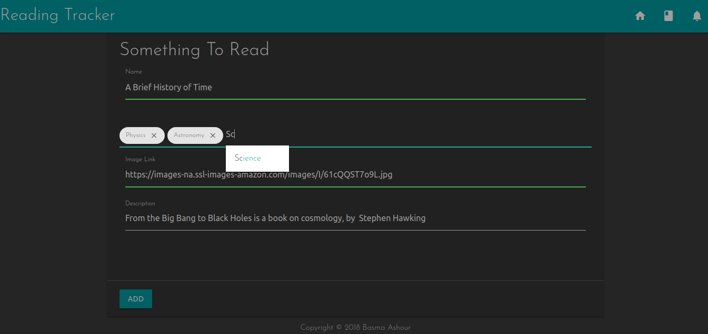

# Reading Tracker

An app to track control what you read.
It allows you to add everything you read with their tags, track them and add a time to read each of them.

- Compatible with Python **3+**.

Author: [Basma Ashour](mailto:basmaashouur@gmail.com).

---
